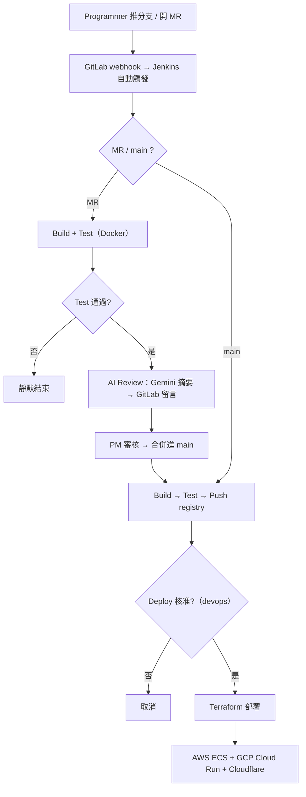

# tibame_project — 0050 即時儀表板 × 全自動 CI/CD 多雲部署

一支台股 **0050 ETF 即時儀表板**，以及它背後一條從「推程式碼」到「多雲上線」的**完整自動化流水線**：自架 GitLab + Jenkins 自動建置測試、**AI 程式碼審查**、人工核准、**Terraform 多雲部署（AWS / GCP / Cloudflare）**。

應用程式本身只是「被部署的對象」；專案重點在這條 CI/CD 與部署流程。

- **成品（即時儀表板）**：<https://buy0050.xyz>
- **專案介紹網站**：<https://easonhuang.pages.dev>

## 架構



## 重點

- **全自動觸發**：GitLab webhook 通知 Jenkins（multibranch），另有定期掃描作為後備。
- **AI 程式碼審查**：每個 MR 測試通過後，用 Flue 框架驅動 Gemini 讀 diff，產生 100 字摘要貼回 GitLab。
- **角色分工**：以三個 GitLab 帳號分工 — 開發者開 MR、PM 審核合併、devops 核准部署。
- **進度可視化**：main 流程全程用單一可即時編輯的 Discord 訊息追蹤建置/測試/推送/部署。
- **多雲部署**：同一份映像用 Terraform 部署到 AWS ECS、GCP Cloud Run，DNS 由 Cloudflare 管理。
- **無長期金鑰**：AWS 用 OIDC、GCP 用 Workload Identity Federation 取得臨時憑證。

## 專案結構

```
.
├── first_project/      # Flask 0050 即時儀表板（被部署的應用）
│   ├── src/            # app.py、templates、static
│   ├── test/           # 測試
│   └── Dockerfile
├── Jenkinsfile         # Jenkins multibranch CI/CD pipeline（核心）
├── ci/flue/            # AI 程式碼審查 agent（Flue + Gemini）
├── terraform/          # IaC：AWS / GCP / Cloudflare
├── website/            # 專案介紹靜態網站（Cloudflare Pages + AI 問答）
└── docker-compose.yml  # 本地起整支應用
```

## 應用程式

- Python **Flask** + **Chart.js**，以 **Docker** 容器執行（埠 19191）。
- 資料來自 **Yahoo Finance**（0050.TW），每 10 秒更新。
- API：`/api/data`（即時報價）、`/api/history`（當日分鐘走勢）、`/api/holdings`（成份股）、`/api/status`（健康檢查）。

### 本地執行

```bash
docker compose up --build
# 開 http://localhost:19191
```

或：

```bash
cd first_project
pip install -r requirements.txt
python run.py
```

## CI/CD 流程

程式碼在自架 GitLab，CI 由自架 Jenkins（multibranch pipeline）執行。

**MR（開發中）流程**
1. 開發者推分支、開 MR → Jenkins 自動建置。
2. **Build**（`docker build`）→ **Test**（啟動容器做健康檢查）。
3. PM 審核 AI 摘要後合併進 main。

**main（合併後）流程**
1. **Build → Test → Push**（映像推到私有 registry）。
2. **部署關卡**：需 devops 核准。
3. 核准後執行多雲部署。
4. 全程用單一可編輯的 Discord 訊息追蹤各階段進度與成敗。

## AI 程式碼審查

以 **Flue**（Node 框架）驅動 **Gemini** 讀取 MR 的 git diff，產生 100 字內中文審查摘要，測試通過後立即貼回 GitLab MR 留言。依賴預先打包進 CI 環境，可即時產出。

## 部署（Terraform）

- 用 **Terraform** 宣告式管理雲端資源，state 存於 AWS S3。
- **AWS**：映像推 ECR、由 ECS 執行（OIDC `assume-role-with-web-identity`）。
- **GCP**：推 Artifact Registry、部署到 Cloud Run（Workload Identity Federation）。
- **Cloudflare**：管理 DNS。
- 運算資源由 `enable_compute` 變數控制；`terraform apply -var="enable_compute=false"` 即可回收運算資源（保留 registry 與 state）。

## 技術棧

Jenkins · GitLab · Docker · Terraform · AWS（ECS/ECR）· GCP（Cloud Run/Artifact Registry）· Cloudflare · Gemini · Flue · Discord；應用程式為 Flask / Python。

---

> 註：本專案的 CI/CD 實際在自架 GitLab + Jenkins 上運作；此 repo 內 `.github/workflows` 為 GitHub 上的展示用途。
